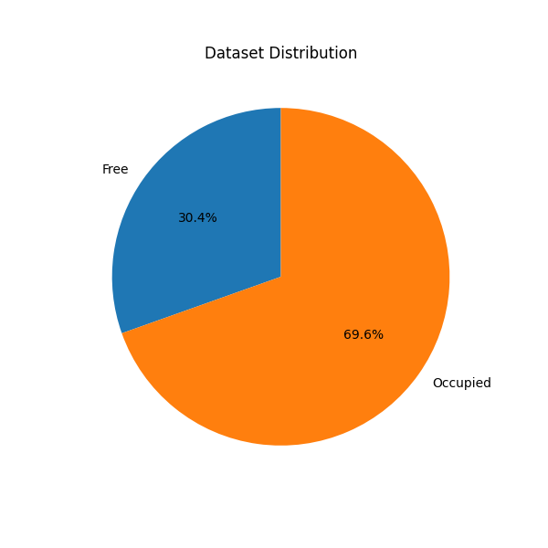
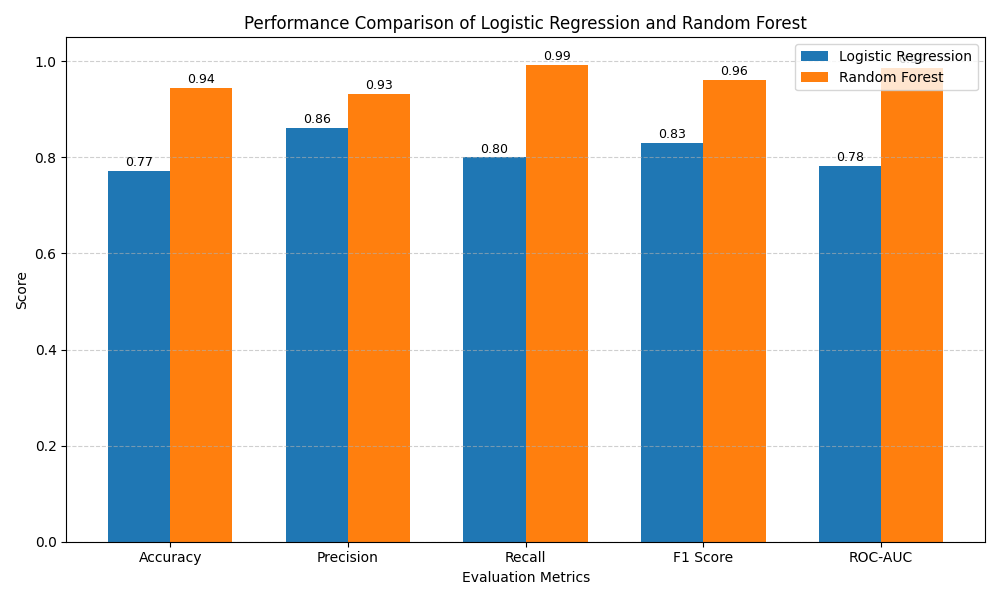
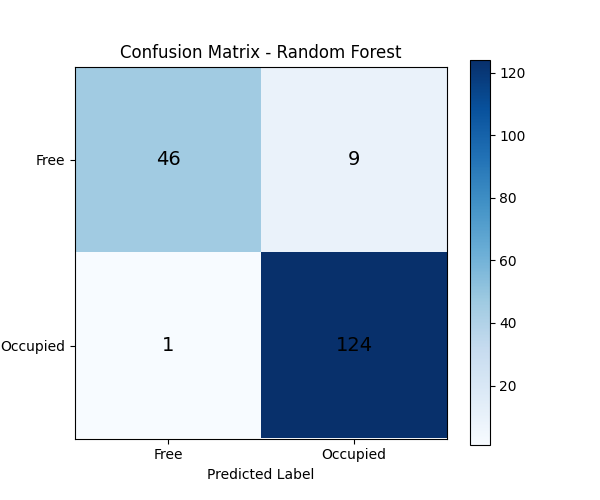
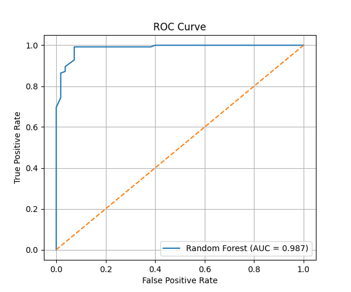

# 🚗 Parking Space Occupancy Classification using Machine Learning

## 📌 Project Overview

This project was developed as **Task 1** during my **Artificial Intelligence and Machine Learning Internship at Alfido Tech**.

The objective of this project is to classify parking spaces into different occupancy categories using supervised machine learning algorithms. The model analyzes parking slot images and predicts whether a parking space is:

- 🟢 Free
- 🔴 Occupied
- 🟡 Partial

Two machine learning algorithms were implemented and compared:

- Logistic Regression
- Random Forest Classifier

The Random Forest model achieved the highest classification accuracy and was selected as the final model.

---

## 🎯 Objectives

- Build a supervised classification model.
- Extract parking slot images from the dataset.
- Train multiple machine learning models.
- Compare model performance.
- Evaluate using various classification metrics.
- Visualize model performance using graphs.

---

## 📂 Dataset

The dataset consists of parking lot images along with parking slot annotations.

### Dataset Files

```
dataset/
images/
boxes/
annotations.xml
parking.csv
```

### Classes

- Free
- Occupied
- Partial

---

## 🛠️ Technologies Used

- Python
- NumPy
- Pandas
- OpenCV
- Scikit-learn
- Matplotlib

---

## 📁 Project Structure

```
Parking Space Occupancy Classification
│
├── dataset/
├── images/
├── boxes/
├── annotations.xml
├── parking.csv
├── extract_parking_spots.py
├── train_model.py
├── main.py
├── Confusion_Matrix.png
├── Dataset_Distribution.png
├── Performance_Comparison.png
├── ROC_curve.png
└── README.md
```

---

## ⚙️ Machine Learning Models

### Logistic Regression

- Accuracy: **77.22%**

### Random Forest Classifier

- Accuracy: **94.44%**

The Random Forest model significantly outperformed Logistic Regression in terms of accuracy and classification performance.

---

## 📊 Model Performance

### Logistic Regression

| Metric | Score |
|---------|-------|
| Accuracy | 77.22% |
| Precision | 0.8621 |
| Recall | 0.8000 |
| F1 Score | 0.8299 |
| ROC-AUC | 0.7831 |

---

### Random Forest

| Metric | Score |
|---------|-------|
| Accuracy | 94.44% |
| Precision | 0.9323 |
| Recall | 0.9920 |
| F1 Score | 0.9612 |
| ROC-AUC | 0.9868 |

---

## 📈 Cross Validation

```
Scores:
0.8278
0.9833
0.9553
0.9832
0.9330

Mean Accuracy:
93.65%
```

---

# 📷 Results

## Dataset Distribution



---

## Performance Comparison



---

## Confusion Matrix



---

## ROC Curve



---

## ▶️ How to Run

### Clone Repository

```bash
git clone https://github.com/yourusername/Alfido-Tech-Internship.git
```

### Navigate to Project

```bash
cd Alfido-Tech-Internship
```

### Install Dependencies

```bash
pip install -r requirements.txt
```

If requirements.txt is unavailable, install manually:

```bash
pip install numpy pandas matplotlib opencv-python scikit-learn
```

### Run

```bash
python main.py
```

---

## 📌 Future Improvements

- Deep Learning using CNN
- Real-time parking detection
- Live CCTV integration
- Mobile/Web application deployment
- Larger balanced dataset

---

## 👨‍💻 Internship Details

**Company:** Alfido Tech

**Internship Domain:** Artificial Intelligence & Machine Learning

**Task:** Task 1 – Supervised Classification Model

---

## 🙋 Author

**BHAVANA**

Computer Science Student at GAYATRI VIDYA PARISHAD COLLEGE OF ENGINEERING

Artificial Intelligence & Machine Learning Intern at Alfido Tech

---

## ⭐ Acknowledgements

- Alfido Tech
- Scikit-learn
- OpenCV
- Kaggle Dataset
